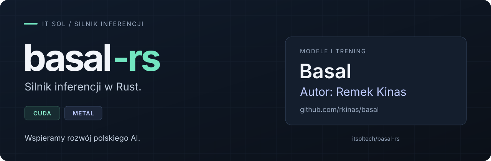

<p align="center">
  
</p>

<h1 align="center">basal-rs</h1>

<p align="center">
  <strong>Silnik inferencji w Rust dla modeli Basal autorstwa Remka Kinasa.</strong>
</p>

<p align="center">
  <a href="https://github.com/itsoltech/basal-rs/actions/workflows/lint.yml"></a>
  <a href="LICENSE"></a>
  <a href="#budowanie"></a>
  <a href="#budowanie"></a>
</p>

<p align="center">
  <a href="#instalacja">Instalacja</a> ·
  <a href="#wyniki">Wyniki</a> ·
  <a href="#serwer">API</a> ·
  <a href="#dokumentacja">Dokumentacja</a> ·
  <a href="https://github.com/rkinas/basal">Basal upstream</a>
</p>

[Basal](https://github.com/rkinas/basal) — modele, ich trening, wagi i protokół
decyzyjny — jest dziełem **Remka Kinasa**, rozwijanym na bazie modeli Bielik.
Zdolności decyzyjne i jakość odpowiedzi pochodzą z tych modeli.

**Nasz wkład to silnik inferencji i serwer w Rust**, rozwijane przez
[IT SOL](https://github.com/itsoltech): wykonanie obliczeń na GPU, optymalizacja
pakowania żądań, kernele i harmonogram serwera. Backend CUDA (NVIDIA,
sprawdzony na RTX 6000 Ada) i Metal (Apple Silicon, sprawdzony na M1 Pro i M2 Max).
Serwer implementuje istniejący kontrakt API **TypeSafe System One** oraz
endpoint zgodny z serwerem upstream. Atrybucję portowanych elementów Basala
i modeli bazowych zawiera [NOTICE](NOTICE).

Rozwijamy ten silnik, by ułatwiać korzystanie z polskich modeli na NVIDIA
i Apple Silicon oraz wspierać rozwój polskiego AI.

Runtime odtwarza protokół decyzyjny upstream: ten sam prompt, te same
token IDs, oba porządki opcji, uśrednienie i kalibracja z `CALIBRATION.json`.
Różni się sposobem wykonania: pakowaniem promptów w drzewo wspólnych
prefiksów, własnymi kernelami i harmonogramem serwera. Zgodność decyzji
z referencją FP32 oraz różnice numeryczne opisują [pomiary poniżej](#wyniki).

> „Nie będę implementował swojej wersji – Wasza/Twoja jest bardzo dobra i wskażę
> na nią w swoim repo jeśli pozwolicie. Bardzo dobrze zrobione.”
>
> — **Remek Kinas**, autor Basala, po przeglądzie silnika basal-rs.
> [Wpis na X](https://x.com/KinasRemek/status/2107539877839384742)

## Instalacja

```sh
# macOS, Apple Silicon
brew install itsoltech/tap/basal-rs

# Linux x86_64 z kartą NVIDIA (pobiera też biblioteki CUDA; z hosta potrzebny tylko sterownik),
# także macOS bez Homebrew
curl -fsSL https://raw.githubusercontent.com/itsoltech/basal-rs/main/install.sh | sh

basal doctor    # co jest na maszynie, czego brakuje i jak to naprawić
basal serve     # http://127.0.0.1:8000; przy pierwszym starcie pobiera basal-1.5-4.5B
```

Konfiguracja modeli: `basal init`, aktualizacja: `basal update` (albo
`brew upgrade`), usunięcie wszystkiego: `basal uninstall --models`. Obraz
Docker: [niżej](#uruchomienie-w-dockerze). Wymagania, ścieżki i szczegóły:
[docs/INSTALL.md](docs/INSTALL.md).

## Co wnosi silnik basal-rs

- **Wspólny stan liczony raz** — drzewo prefiksów współdzieli obliczenia między pytaniami i żądaniami w partii.
- **Dwa backendy GPU** — własne kernele CUDA i Metal, bez środowiska Pythona w runtime.
- **Serwowanie istniejących API** — kontrakt TypeSafe System One i konwencje serwera Basal; kilka modeli w jednym procesie.
- **Jawne pomiary** — porównania z upstream FP32, opóźnienia i przepustowość wraz z danymi w [reports/](reports/README.md).

## Modele

| Model | Status |
|---|---|
| `Remek/basal-1.5-max` (11B), rewizja `be1b5ee7` | główny cel, CUDA, Metal ([M2 Max](reports/metal-m2-max-1.5/README.md), [M1 Pro](reports/metal-m1-pro-1.5/README.md)) |
| `Remek/basal-1.5-4.5B`, rewizja `784a683b` | CUDA ([zgodność](reports/compat-1.5-small/README.md), [wydajność](reports/perf-1.5-small/README.md)), Metal ([M2 Max](reports/metal-m2-max-1.5/README.md), [M1 Pro](reports/metal-m1-pro-1.5/README.md)) |
| `Remek/basal-1.5-mini` (1.5B), rewizja `1978d070` | CUDA ([zgodność](reports/compat-1.5-small/README.md), [wydajność](reports/perf-1.5-small/README.md)), Metal ([M2 Max](reports/metal-m2-max-1.5/README.md), [M1 Pro](reports/metal-m1-pro-1.5/README.md)) |
| `Remek/basal-1.0-4.5B`, rewizja `b9528804` | CUDA, Metal ([M1 Pro](reports/metal-m1-pro/README.md)) |

Typy pytań: `choice` (2–10 opcji oraz 11–255 przybliżoną strategią grupową), `noul`,
`score`, a z basal-1.5 także `multi`, `act`, `facts: "auto"` i `evidence`.
Strategia dla ponad 10 opcji jest rozszerzeniem runtime'u;
[jej ewaluacja](reports/large-choice/README.md) jest osobna od zgodności z upstream.

## Wyniki

Porównujemy wykonanie tych samych modeli Basal przez dwa silniki inferencji.
Poniższe wyniki opisują wydajność runtime'u i zgodność z upstream;
zdolności modeli do podejmowania decyzji są zasługą ich autora.

basal-1.5-max na RTX 6000 Ada z limitem mocy 250 W; upstream v1.5.0
`basal-serve --mode fast` (BF16, torch.compile, CUDA graphs) na tej samej
karcie. Szczegóły i dane:
[reports/rust-cuda-1.5-max](reports/rust-cuda-1.5-max/README.md).

| Pomiar | Upstream | basal-rs |
|---|---:|---:|
| Pojedyncza decyzja (basal-bench, mediana) | 90,7 ms | 63,4–64,0 ms |
| Jedno pytanie przez HTTP, p50 | 118 ms | 72 ms |
| Jedno pytanie przez HTTP, 32 klientów | 6,8 żądania/s | 21,8 żądania/s |
| Dokument 16k tokenów, 5 pytań (300 W) | 112,2 s | 5,3 s |
| Ruch mieszany (stany 0,1–16k tokenów, 1–14 pytań) | 17 żądań/min | 119 żądań/min |

Przy domyślnym limicie 300 W (upstream nie był mierzony w tych warunkach)
basal-rs obsługuje ~20% więcej: 17,3 żądania/s przy jednym kliencie (p50
56 ms), 26,3 żądania/s przy 32 klientach, ruch mieszany 143 żądania/min
([pomiar](reports/rust-cuda-1.5-max/power/README.md)).

Mniejsze modele przy 300 W, ten sam klient, upstream v1.5.0 `fast`
([pomiar](reports/perf-1.5-small/README.md)):

| Pomiar | 1.5-4.5B upstream | 1.5-4.5B basal-rs | 1.5-mini upstream | 1.5-mini basal-rs |
|---|---:|---:|---:|---:|
| Pojedyncza decyzja (mediana) | 31,5 ms | 20,4 ms | 9,9 ms | 7,9 ms |
| Jedno pytanie przez HTTP, 32 klientów | 21,8 żądania/s | 54,5 żądania/s | 60,2 żądania/s | 141,7 żądania/s |
| Ruch mieszany, 32 klientów¹ | 59 żądań/min | 336 żądań/min | 818 żądań/min | 2501 żądań/min |

¹ Dla mini bez dokumentów ~8k i ~16k tokenów (limit 8192 pozycji modelu).

Zgodność basal-1.5-max na CUDA z upstream FP32 na 44 przykładach basal-bench: te same decyzje
44/44; maksymalna różnica logitu 1,3·10⁻⁴ dla ścieżki FP32 i 0,27 dla
domyślnej FP16 (mediana 0,013, maks. różnica prawdopodobieństwa po
kalibracji 0,0008). `multi`, `act`, `facts` i `evidence` dają te same pola
odpowiedzi co upstream; `facts` jest zgodne co do bajtu na 432 stanach.
W opisanych pomiarach CUDA z tabelą GEMM niezależną od partii wynik pytania
nie zależy od tego, z czym trafi do partii (bitowo te same logity
pojedynczo, w partii i pod obciążeniem HTTP).

Apple Silicon (Metal), pojedyncza decyzja (mediana, metodyka basal-bench)
wobec upstream v1.5.0 z MLX: ścieżka serwowana (bf16) i ten sam backend w
f16, w tej samej precyzji co basal-rs:

| Model | M2 Max: MLX bf16 | M2 Max: MLX f16 | M2 Max: basal-rs | M1 Pro: MLX bf16 | M1 Pro: MLX f16 | M1 Pro: basal-rs |
|---|---:|---:|---:|---:|---:|---:|
| basal-1.5-max | 992 ms | 886 ms | 526 ms | 2265 ms | 1969 ms | 1197–1323 ms |
| basal-1.5-4.5B | 427 ms | 372 ms | 235 ms | 955 ms | 823 ms | 495–502 ms |
| basal-1.5-mini | 151 ms | 130 ms | 80 ms | 318–323 ms | 274–276 ms | 170–174 ms |

Na M2 Max basal-rs obsługuje 1,9–2,0 raza więcej decyzji na sekundę niż MLX
f16 i 2,2–2,35 raza więcej niż MLX bf16
([M2 Max](reports/metal-m2-max-1.5/README.md),
[M1 Pro](reports/metal-m1-pro-1.5/README.md)). basal-rs f16 daje decyzje
FP32 na 44/44 przykładach dla trzech modeli; upstream MLX bf16 na
basal-1.5-max zmienia jedną. Na M1 Pro mierzona była wersja z SDPA z MLX w
attention; obecne attention po jednostkach drzewa daje wynik niezależny od
pakowania partii przy tym samym czasie pełnej decyzji
([pomiar](reports/metal-m2-max-tree/README.md)).

## Uruchomienie w Dockerze

Na NVIDIA bez instalacji na hoście. Na Apple Silicon: [instalacja](#instalacja) albo [budowanie z Metal](#budowanie).

Wymagane: sterownik NVIDIA i NVIDIA Container Toolkit. Modele wpisane w
[serve.yml](serve.yml) (repozytorium Hugging Face i rewizja):

```sh
docker compose up -d          # obraz ghcr.io/itsoltech/basal-rs:latest i start
docker compose logs -f        # pobieranie modeli, tabele GEMM, start serwera
curl localhost:8000/health
```

Obraz publikuje tylko wydanie ([release.yml](.github/workflows/release.yml)
wywołuje [docker.yml](.github/workflows/docker.yml) po opublikowaniu paczek).
Tagi wydania `vX.Y.Z`: `vX.Y.Z`, `vX.Y` i `vX` (najnowsze wydanie danej serii)
oraz `latest` (najnowsze wydanie), np. `ghcr.io/itsoltech/basal-rs:v0.1`
przypina serię 0.1 z poprawkami. Push na `main` niczego nie publikuje. Jeden obraz zawiera kernele dla compute
capability 8.0, 8.9 i 9.0 (A100, RTX 30xx/40xx, RTX 6000 Ada, L40S, H100) i
przy starcie wybiera właściwe dla karty. Każdy tag ma też warianty `-sm80` i
`-sm90` (np. `v0-sm80`), nazwy dawnych obrazów per architektura, wskazujące
ten sam obraz. Na RTX
6000 Ada wynik jest bitowo ten sam co z obrazów per architektura
([pomiar](reports/cuda-multi-ptx/README.md),
[obrazy per architektura](reports/docker-images/README.md)).

Przy pierwszym starcie serwer pobiera modele z Hugging Face i generuje dla
nich tabele GEMM (jednorazowo; basal-1.5-mini: ~35 s pobierania i ~150 s
tabeli na RTX 6000 Ada). Oba trafiają do wolumenu `basal-data` (`/data`),
więc kolejne starty trwają kilka sekund, a przy braku dostępu do Hugging Face
serwer wczytuje modele z cache. Repozytoria prywatne: `HF_TOKEN` w
środowisku. `docker stop` zamyka serwer łagodnie (SIGTERM).

Własny build (wieloetapowy: toolkit CUDA i Rust, zależności w osobnej
warstwie przez cargo-chef, obraz wynikowy z samym runtime CUDA):

```sh
docker build -t basal-rs -f docker/Dockerfile .
docker run -d --gpus all -p 8000:8000 -v "$PWD/serve.yml:/config/serve.yml:ro" \
  -v basal-data:/data -e HF_TOKEN basal-rs
```

## Budowanie

Rust stable (sprawdzony na 1.95).

```sh
# Metal (macOS)
cargo build --release

# CUDA (Linux, sm_89; obraz z toolkitem: tools/cuda/Dockerfile)
docker build -t basal-dev:cuda tools/cuda
docker run -d --name basal-dev --gpus all --ipc=host -v "$PWD":/work -w /work basal-dev:cuda sleep infinity
docker exec basal-dev cargo build --release --features basal-cli/cuda
```

Kernele CUDA są kompilowane do PTX przez `nvcc` w `crates/basal-gpu/build.rs`
dla architektur z `CUDA_COMPUTE_CAPS` (domyślnie 80, 89 i 90; bez niej
`CUDA_COMPUTE_CAP` wybiera jedną, a kernele candle kompilują się dla
`CUDA_COMPUTE_CAP`). Przy starcie runtime ładuje PTX najwyższej architektury nie
wyższej niż karta. Obraz `basal-dev:cuda` ustawia `CUDA_COMPUTE_CAP=89`.

## Model

W pliku konfiguracji serwera wystarczy `repo` i `revision` (pobieranie przy
starcie). Ręcznie, np. dla poleceń innych niż `serve`:

```sh
huggingface-cli download Remek/basal-1.5-max \
  --revision be1b5ee7e7a9755a931262fa7fab4f59be0fd03c --local-dir .models/basal-1.5-max
```

Runtime sprawdza przy ładowaniu `config.json`, `basal.json`, szablon czatu i
tokenizer; niezgodność z obsługiwanym kontraktem promptu kończy się błędem.

## Serwer

Jeden proces obsługuje jeden lub kilka modeli. Konfiguracja w YAML
([serve.example.yml](serve.example.yml)):

```sh
./target/release/basal serve --config serve.example.yml
```

```yaml
addr: 0.0.0.0:8000
default_model: basal-1.5-max
models:
  - repo: Remek/basal-1.5-max            # pobierany z Hugging Face przy starcie
    revision: be1b5ee7e7a9755a931262fa7fab4f59be0fd03c
  - path: .models/basal-1.5-4.5B         # albo lokalny katalog
  - repo: Remek/basal-1.5-mini
    long_tokens: 0
```

Żądanie trafia do modelu z pola `model` (nazwa z `basal.json` modelu);
`/v1/basal` bez tego pola trafia do `default_model`, a nieznana nazwa daje
błąd 422 z listą obsługiwanych modeli. Każdy model ma własną kolejkę i tor
długich żądań; wszystkie dzielą GPU tak, że krótkie partie dowolnego modelu
idą przed długimi żądaniami. Pamięć GPU to suma wag modeli (bf16/f16:
1.5-max ~23 GB, 1.5-4.5B ~9,5 GB, 1.5-mini ~3,2 GB) plus aktywacje.

Jeden model bez pliku konfiguracji:

```sh
./target/release/basal serve --model .models/basal-1.5-max \
  --gemm-table reports/rust-cuda-1.5-max/gemm-equiv/gemm-algos-f16-invariant-groups.json \
  --addr 0.0.0.0:8000
```

| Endpoint | Opis |
|---|---|
| `POST /v1/systemone` | TypeSafe System One: ścisła walidacja, odpowiedzi i confidence TypeSafe, rozszerzenia basal-1.5 |
| `POST /v1/basal` | konwencje `Server.decide` upstream v1.5.0: walidacja `to_items`, `confidence = max(p)`, błędy jako 422 `{"error"}` |
| `GET /v1/models` | lista modeli TypeSafe z polami upstream `mode` i `early_exit` |
| `GET /health` | gotowość |

Odpowiedzi mają nagłówki `x-basal-queue-ms`, `x-basal-compute-ms` i
`x-basal-batch-requests`.

```sh
curl --fail-with-body localhost:8000/v1/systemone -H 'content-type: application/json' -d '{
  "model": "basal-1.5-max",
  "state": "Zgłoszenie: klient prosi o zwrot pieniędzy za uszkodzony telefon.",
  "questions": {
    "dept": {"type": "choice", "instructions": "Do którego działu skierować zgłoszenie?",
             "criteria": {"returns": "Zwroty", "tech": "Wsparcie techniczne", "sales": "Sprzedaż"}},
    "urgent": {"type": "noul", "instructions": "Czy sprawa jest pilna?"}
  }
}'
```

Opcje modelu (klucze YAML w `models`; dla jednego modelu te same opcje
wiersza poleceń, np. `--max-batch-tokens`):

| Klucz | Domyślnie | Znaczenie |
|---|---|---|
| `repo`, `revision` | | repozytorium Hugging Face `owner/name` i gałąź, tag albo commit (domyślnie `main`); pobierane do cache Hugging Face (`HF_HOME`, w obrazie `/data/hf`), przy braku dostępu do Hub z cache |
| `path` | | lokalny katalog modelu (zamiast `repo`) |
| `gemm_table` | `auto` | tabela algorytmów cuBLASLt (opis niżej); `none`: algorytmy dobierane przy pierwszym użyciu, wynik może zależeć od partii; albo ścieżka tabeli |
| `dtype` | `f16` | `f16`, `bf16` albo `f32` (referencja numeryczna, wolna) |
| `max_batch_tokens` | 8192 | tokeny jednej partii, liczone po współdzieleniu prefiksów |
| `schedule` | `hrrn` | kolejność przyjmowania żądań: `hrrn` (krótkie przed długimi, bez zagłodzenia) albo `fifo` |
| `long_tokens` | 4096 | żądania powyżej tej liczby tokenów idą do toru długich żądań, który oddaje GPU krótkim partiom między warstwami; `0` wyłącza |
| `state_cache_mb` | 0 | cache K/V stanu między żądaniami |

Opcje procesu: `addr` (nadpisywany przez zmienną `BASAL_ADDR`; w obrazie
`0.0.0.0:8000`), `default_model`, `max_inflight` (1024, limit żądań w
kolejce i w trakcie wszystkich modeli; nadmiar dostaje 503), `long_slice_ms`
(100, minimalny czas pracy toru długich żądań między oddaniami GPU),
`gemm_cache` (`.cache/gemm`).

Tabela GEMM ustala algorytmy cuBLASLt tak, by wynik pytania nie zależał od
partii: dla każdej klasy liczby wierszy najszybszy algorytm z grupy
algorytmów dających bitowo te same wyniki
([pomiar](reports/rust-cuda-1.5-max/gemm-equiv/README.md)). Zależy od
modelu (kształtów wag), GPU, wersji cuBLASLt i precyzji. Przy `gemm_table:
auto` serwer szuka tabeli w `gemm_cache` i generuje ją przy starcie, gdy jej
nie ma albo powstała na innym GPU lub cuBLASLt (jednorazowo, kilka do
kilkudziesięciu minut). Tabela z repozytorium
(`reports/rust-cuda-1.5-max/gemm-equiv/gemm-algos-f16-invariant-groups.json`)
jest dla basal-1.5-max na RTX 6000 Ada z cuBLASLt 12.9.1. Ręcznie:
`basal gemm-search --model DIR --invariant --out gemm.json`. Serwer odmawia
startu z tabelą, która nie obejmuje kształtów wag modelu.

## Polecenia

`basal --help` opisuje wszystkie polecenia. Poza `serve` najczęściej:
`decide` (jedno żądanie z pliku), `export` i `compare` (porównanie z
referencją upstream), `bench` i `bench-requests` (pomiary), `gemm-search`.

## Struktura

| Katalog | Zawartość |
|---|---|
| `crates/basal-core` | kontrakt System One, prompt, tokenizer, pakowanie, decyzje, `facts`, `evidence`, silnik i trait `Backend` |
| `crates/basal-gpu` | forward Llama na candle z własnymi kernelami CUDA i Metal, cuBLASLt, attention po węzłach drzewa |
| `crates/basal-cli` | polecenie `basal` i serwer HTTP |
| `docker/`, `docker-compose.yml`, `serve.yml` | obraz do uruchamiania serwera i domyślna konfiguracja modeli |
| `tools/cuda` | obraz deweloperski CUDA (budowanie, pomiary, upstream) |
| `tools/reference` | eksport referencji z upstream, zestawy żądań |
| `tools/bench` | pomiary A/B i obciążeniowe, generatory ruchu |
| `contracts/typesafe` | migawka OpenAPI TypeSafe |
| `reports` | pomiary zgodności i wydajności z danymi |

## Dokumentacja

- [Instalacja](docs/INSTALL.md): Homebrew, skrypt, `basal doctor` / `setup` / `init` / `update`, ścieżki plików.
- [Architektura](docs/ARCHITECTURE.md): potok żądania, pakowanie, kernele, harmonogram serwera.
- [Zgodność API](docs/SYSTEM_ONE.md): TypeSafe System One, endpoint upstream, rozszerzenia basal-1.5.
- [Pomiary](docs/BENCHMARKS.md): metodyka, narzędzia, odtwarzanie wyników.
- [Raporty](reports/README.md).

## Licencja

Apache-2.0. Kod portuje zachowanie [rkinas/basal](https://github.com/rkinas/basal)
(Apache-2.0); atrybucja w [NOTICE](NOTICE). Wagi modeli mają własne licencje
na Hugging Face.
